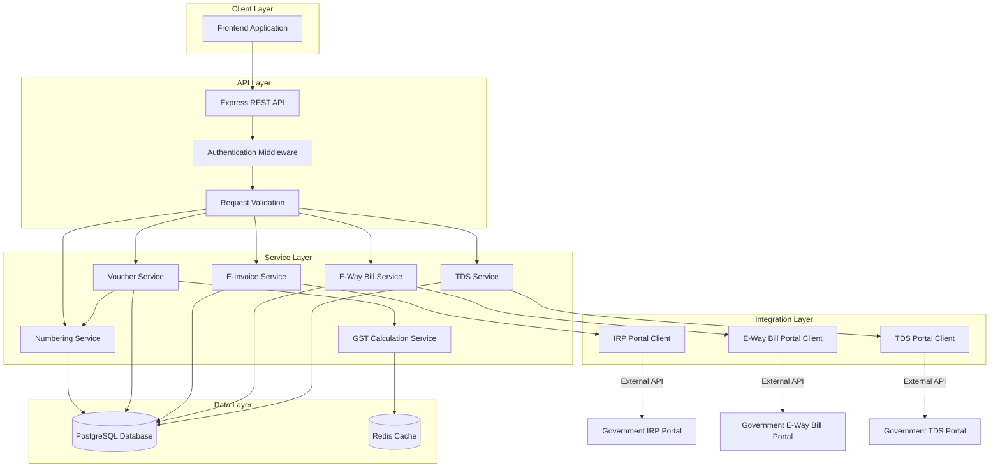

# Design Document: Indian Invoice System Backend

## Overview

The Indian Invoice System Backend is a comprehensive GST-compliant invoicing system built on Node.js with Express, Sequelize ORM, and PostgreSQL. The system extends an existing accounting platform with advanced features including flexible invoice numbering, E-Invoice integration with the IRP portal, E-Way Bill generation, TDS calculations, and support for multiple invoice types required under Indian GST regulations.

### Design Goals

1. **GST Compliance**: Ensure all invoice types and calculations comply with Indian GST Act requirements
2. **Flexibility**: Support multiple numbering series, invoice types, and business scenarios
3. **Integration**: Seamless integration with government portals (IRP, E-Way Bill, TDS)
4. **Reliability**: Robust error handling, retry mechanisms, and audit trails
5. **Performance**: Efficient database queries with proper indexing and caching
6. **Multi-tenancy**: Complete data isolation between organizations
7. **Extensibility**: Modular architecture allowing easy addition of new features

### Technology Stack

- **Runtime**: Node.js (v18+)
- **Framework**: Express.js
- **ORM**: Sequelize
- **Database**: PostgreSQL (v14+)
- **Authentication**: JWT-based authentication
- **External APIs**: IRP Portal, E-Way Bill Portal, TDS Portal
- **Testing**: Jest for unit tests, fast-check for property-based tests

## Architecture

### High-Level Architecture




### Layered Architecture

The system follows a layered architecture pattern:

1. **API Layer**: Handles HTTP requests, authentication, and input validation
2. **Service Layer**: Contains business logic for invoice operations, numbering, GST calculations
3. **Integration Layer**: Manages external API communications with government portals
4. **Data Layer**: Handles database operations and caching

### Key Architectural Patterns

- **Service-Oriented Architecture**: Each major feature (numbering, E-Invoice, E-Way Bill, TDS) is encapsulated in a dedicated service
- **Repository Pattern**: Data access is abstracted through Sequelize models
- **Factory Pattern**: Used for creating different invoice types
- **Strategy Pattern**: Used for different GST calculation strategies (intrastate vs interstate)
- **Retry Pattern**: Exponential backoff for external API calls
- **Circuit Breaker**: Prevents cascading failures when external services are down

## Components and Interfaces

### 1. Numbering Service

**Responsibility**: Generate sequential, unique voucher numbers based on configurable series

**Key Methods**:


```typescript
interface NumberingService {
  // Generate next voucher number for a series
  generateVoucherNumber(
    tenantId: string,
    voucherType: string,
    seriesId?: string,
    branchId?: string
  ): Promise<VoucherNumberResult>;
  
  // Create a new numbering series
  createNumberingSeries(
    tenantId: string,
    seriesConfig: NumberingSeriesConfig
  ): Promise<NumberingSeries>;
  
  // Update existing numbering series
  updateNumberingSeries(
    seriesId: string,
    updates: Partial<NumberingSeriesConfig>
  ): Promise<NumberingSeries>;
  
  // Set a series as default for a voucher type
  setDefaultSeries(seriesId: string): Promise<void>;
  
  // Preview next number without consuming it
  previewNextNumber(seriesId: string): Promise<string>;
  
  // Check if reset is needed and perform reset
  checkAndResetSequence(series: NumberingSeries): Promise<void>;
  
  // Format voucher number based on series configuration
  formatVoucherNumber(series: NumberingSeries, sequence: number): string;
}

interface NumberingSeriesConfig {
  voucherType: string;
  seriesName: string;
  prefix: string;
  format: string;
  separator?: string;
  sequenceLength: number;
  startNumber: number;
  endNumber?: number;
  resetFrequency: 'never' | 'monthly' | 'yearly' | 'financial_year';
  isDefault: boolean;
  branchId?: string;
}

interface VoucherNumberResult {
  voucherNumber: string;
  seriesId: string;
  sequence: number;
}
```

**Implementation Details**:
- Uses database-level row locking (`SELECT FOR UPDATE`) to prevent race conditions
- Implements format token replacement for flexible number formats
- Tracks sequence reset based on configured frequency
- Maintains numbering history for audit trails
- Validates GST compliance (max 16 characters, allowed characters)

### 2. Voucher Service

**Responsibility**: Create, update, and manage vouchers (invoices) with proper accounting entries

**Key Methods**:

```typescript
interface VoucherService {
  // Create a new voucher
  createVoucher(
    tenantId: string,
    voucherData: VoucherCreateInput
  ): Promise<Voucher>;
  
  // Update existing voucher (only if not posted)
  updateVoucher(
    voucherId: string,
    updates: VoucherUpdateInput
  ): Promise<Voucher>;
  
  // Post voucher (finalize and create ledger entries)
  postVoucher(voucherId: string): Promise<Voucher>;
  
  // Cancel voucher
  cancelVoucher(voucherId: string, reason: string): Promise<Voucher>;
  
  // Get voucher by ID
  getVoucher(voucherId: string): Promise<Voucher>;
  
  // List vouchers with filters
  listVouchers(
    tenantId: string,
    filters: VoucherFilters
  ): Promise<PaginatedResult<Voucher>>;
  
  // Convert voucher (e.g., Proforma to Sales Invoice)
  convertVoucher(
    sourceVoucherId: string,
    targetType: string
  ): Promise<Voucher>;
}

interface VoucherCreateInput {
  voucherType: string;
  voucherDate: Date;
  partyLedgerId: string;
  placeOfSupply: string;
  isReverseCharge: boolean;
  items: VoucherItemInput[];
  narration?: string;
  referenceNumber?: string;
  seriesId?: string;
}

interface VoucherItemInput {
  inventoryItemId?: string;
  warehouseId?: string;
  itemDescription: string;
  hsnSacCode: string;
  quantity: number;
  rate: number;
  discountPercent?: number;
  gstRate: number;
}
```

**Implementation Details**:
- Validates voucher data before creation
- Calculates GST amounts using GST Calculation Service
- Generates voucher number using Numbering Service
- Creates double-entry ledger entries automatically
- Handles different voucher types (Sales, Purchase, Bill of Supply, etc.)
- Implements voucher state machine (draft → posted → cancelled)

### 3. GST Calculation Service

**Responsibility**: Calculate CGST, SGST, IGST based on place of supply and GST rates

**Key Methods**:

```typescript
interface GSTCalculationService {
  // Calculate GST for a single item
  calculateItemGST(
    taxableAmount: number,
    gstRate: number,
    supplierState: string,
    placeOfSupply: string,
    isReverseCharge: boolean
  ): GSTBreakdown;
  
  // Calculate GST for entire voucher
  calculateVoucherGST(
    items: VoucherItemInput[],
    supplierState: string,
    placeOfSupply: string,
    isReverseCharge: boolean
  ): VoucherGSTSummary;
  
  // Validate GSTIN format
  validateGSTIN(gstin: string): boolean;
  
  // Extract state code from GSTIN
  extractStateCode(gstin: string): string;
  
  // Determine if transaction is intrastate or interstate
  isIntrastate(supplierState: string, placeOfSupply: string): boolean;
}

interface GSTBreakdown {
  taxableAmount: number;
  cgstAmount: number;
  sgstAmount: number;
  igstAmount: number;
  cessAmount: number;
  totalAmount: number;
}

interface VoucherGSTSummary {
  subtotal: number;
  totalCGST: number;
  totalSGST: number;
  totalIGST: number;
  totalCess: number;
  roundOff: number;
  grandTotal: number;
  itemBreakdowns: GSTBreakdown[];
}
```

**Implementation Details**:
- Implements intrastate calculation: CGST = SGST = (taxableAmount × gstRate) / 200
- Implements interstate calculation: IGST = (taxableAmount × gstRate) / 100
- Handles reverse charge scenarios
- Applies round-off to nearest rupee
- Caches state codes for performance

### 4. E-Invoice Service

**Responsibility**: Generate and manage E-Invoices through IRP portal integration

**Key Methods**:

```typescript
interface EInvoiceService {
  // Generate E-Invoice and get IRN
  generateEInvoice(voucherId: string): Promise<EInvoice>;
  
  // Cancel E-Invoice
  cancelEInvoice(
    eInvoiceId: string,
    reason: string,
    remarks: string
  ): Promise<EInvoice>;
  
  // Get E-Invoice details
  getEInvoice(eInvoiceId: string): Promise<EInvoice>;
  
  // Retry failed E-Invoice generation
  retryEInvoiceGeneration(eInvoiceId: string): Promise<EInvoice>;
  
  // Validate E-Invoice mandatory fields
  validateEInvoiceFields(voucher: Voucher): ValidationResult;
}

interface EInvoice {
  id: string;
  voucherId: string;
  irn: string;
  ackNo: string;
  ackDate: Date;
  signedInvoice: string;
  signedQRCode: string;
  status: 'pending' | 'generated' | 'cancelled';
  errorMessage?: string;
}
```

**Implementation Details**:
- Transforms voucher data to IRP portal JSON format
- Handles authentication with IRP portal (OAuth2)
- Implements retry logic with exponential backoff
- Stores IRN and QR code for invoice printing
- Validates mandatory fields before API call
- Supports both sandbox and production environments

### 5. E-Way Bill Service

**Responsibility**: Generate and manage E-Way Bills for goods movement

**Key Methods**:

```typescript
interface EWayBillService {
  // Generate E-Way Bill
  generateEWayBill(
    voucherId: string,
    transportDetails: TransportDetails
  ): Promise<EWayBill>;
  
  // Cancel E-Way Bill
  cancelEWayBill(
    eWayBillId: string,
    reason: string,
    remarks: string
  ): Promise<EWayBill>;
  
  // Update vehicle details
  updateVehicleDetails(
    eWayBillId: string,
    vehicleNo: string,
    reasonCode: string
  ): Promise<EWayBill>;
  
  // Check if E-Way Bill is required
  isEWayBillRequired(voucher: Voucher): boolean;
  
  // Calculate validity period
  calculateValidityPeriod(distance: number, goodsType: string): Date;
}

interface TransportDetails {
  transporterId: string;
  transporterName: string;
  transportMode: 'road' | 'rail' | 'air' | 'ship';
  vehicleNo: string;
  distance: number;
}

interface EWayBill {
  id: string;
  voucherId: string;
  ewbNo: string;
  ewbDate: Date;
  validUpto: Date;
  status: 'active' | 'cancelled' | 'expired';
  vehicleNo: string;
  transporterId: string;
  transportMode: string;
  distance: number;
}
```

**Implementation Details**:
- Checks threshold (₹50,000) before generation
- Validates transporter GSTIN format
- Calculates validity: 1 day per 200 KM for normal goods
- Supports vehicle number updates during transit
- Handles interstate and intrastate movement rules
- Implements retry logic for API failures

### 6. TDS Service

**Responsibility**: Calculate TDS and generate certificates

**Key Methods**:

```typescript
interface TDSService {
  // Calculate TDS for a purchase voucher
  calculateTDS(
    taxableAmount: number,
    sectionCode: string,
    deducteePAN: string,
    deducteeType: 'individual' | 'company'
  ): TDSCalculation;
  
  // Create TDS entry
  createTDSEntry(
    voucherId: string,
    tdsData: TDSCalculation
  ): Promise<TDSDetail>;
  
  // Generate TDS certificate (Form 16A)
  generateTDSCertificate(
    tdsDetailId: string,
    quarter: string,
    financialYear: string
  ): Promise<TDSCertificate>;
  
  // Generate quarterly TDS return
  generateTDSReturn(
    tenantId: string,
    quarter: string,
    financialYear: string
  ): Promise<TDSReturn>;
  
  // Get TDS sections configuration
  getTDSSections(): TDSSection[];
}

interface TDSCalculation {
  sectionCode: string;
  tdsRate: number;
  taxableAmount: number;
  tdsAmount: number;
  thresholdApplied: boolean;
}

interface TDSSection {
  code: string;
  description: string;
  rate: number;
  threshold: number;
  applicableTo: string;
}
```

**Implementation Details**:
- Supports sections: 194C (contractors), 194I (rent), 194J (professional fees), 194H (commission)
- Validates PAN format before TDS deduction
- Applies threshold checks
- Different rates for individuals vs companies (e.g., 194C: 1% for individuals, 2% for companies)
- Generates sequential certificate numbers
- Creates TDS payable ledger entries

## Data Models

### Numbering Series Model

```typescript
interface NumberingSeries {
  id: string;
  tenantId: string;
  branchId?: string;
  voucherType: string;
  seriesName: string;
  prefix: string;
  format: string;
  separator: string;
  sequenceLength: number;
  currentSequence: number;
  startNumber: number;
  endNumber: number;
  resetFrequency: 'never' | 'monthly' | 'yearly' | 'financial_year';
  lastResetDate?: Date;
  isDefault: boolean;
  isActive: boolean;
  createdAt: Date;
  updatedAt: Date;
}
```

### Numbering History Model

```typescript
interface NumberingHistory {
  id: string;
  seriesId: string;
  voucherId: string;
  generatedNumber: string;
  sequenceUsed: number;
  generatedAt: Date;
  tenantId: string;
}
```

### Voucher Model

```typescript
interface Voucher {
  id: string;
  voucherNumber: string;
  voucherType: string;
  voucherDate: Date;
  partyLedgerId: string;
  placeOfSupply: string;
  isReverseCharge: boolean;
  subtotal: number;
  cgstAmount: number;
  sgstAmount: number;
  igstAmount: number;
  cessAmount: number;
  roundOff: number;
  totalAmount: number;
  narration?: string;
  referenceNumber?: string;
  dueDate?: Date;
  status: 'draft' | 'posted' | 'cancelled';
  tenantId: string;
  createdBy: string;
  createdAt: Date;
  updatedAt: Date;
  
  // Relations
  items: VoucherItem[];
  ledgerEntries: LedgerEntry[];
  eInvoice?: EInvoice;
  eWayBill?: EWayBill;
  tdsDetail?: TDSDetail;
}
```

### Voucher Item Model

```typescript
interface VoucherItem {
  id: string;
  voucherId: string;
  inventoryItemId?: string;
  warehouseId?: string;
  itemCode?: string;
  itemDescription: string;
  hsnSacCode: string;
  uqc: string;
  quantity: number;
  rate: number;
  discountPercent: number;
  discountAmount: number;
  taxableAmount: number;
  gstRate: number;
  cgstAmount: number;
  sgstAmount: number;
  igstAmount: number;
  cessAmount: number;
  totalAmount: number;
  tenantId: string;
}
```

### E-Invoice Model

```typescript
interface EInvoice {
  id: string;
  voucherId: string;
  irn: string;
  ackNo: string;
  ackDate: Date;
  signedInvoice: string;
  signedQRCode: string;
  status: 'pending' | 'generated' | 'cancelled';
  errorMessage?: string;
  retryCount: number;
  lastRetryAt?: Date;
  tenantId: string;
  createdAt: Date;
  updatedAt: Date;
}
```

### E-Way Bill Model

```typescript
interface EWayBill {
  id: string;
  voucherId: string;
  ewbNo: string;
  ewbDate: Date;
  validUpto: Date;
  status: 'active' | 'cancelled' | 'expired';
  vehicleNo: string;
  transporterId: string;
  transporterName: string;
  transportMode: 'road' | 'rail' | 'air' | 'ship';
  distance: number;
  tenantId: string;
  createdAt: Date;
  updatedAt: Date;
}
```

### TDS Detail Model

```typescript
interface TDSDetail {
  id: string;
  voucherId: string;
  sectionCode: string;
  tdsRate: number;
  taxableAmount: number;
  tdsAmount: number;
  deducteePAN: string;
  deducteeName: string;
  certificateNo?: string;
  certificateDate?: Date;
  tenantId: string;
  createdAt: Date;
  updatedAt: Date;
}
```

### Ledger Entry Model

```typescript
interface LedgerEntry {
  id: string;
  voucherId: string;
  ledgerId: string;
  debitAmount: number;
  creditAmount: number;
  narration: string;
  tenantId: string;
  createdAt: Date;
}
```


## Correctness Properties

A property is a characteristic or behavior that should hold true across all valid executions of a system—essentially, a formal statement about what the system should do. Properties serve as the bridge between human-readable specifications and machine-verifiable correctness guarantees.

### Property Reflection

After analyzing all acceptance criteria, I identified the following areas where properties can be consolidated:

**Redundancy Analysis:**
- Properties about sequential numbering (1.3, 4.9) can be generalized to a single property about sequence generation
- Properties about separate numbering series (5.5, 6.5, 7.7, 8.4, 9.5) are all instances of the same pattern
- Properties about GST calculation (10.1, 10.2) are complementary cases of the same calculation logic
- Properties about ledger entry creation (5.6, 6.7, 9.4) follow the same pattern for different voucher types
- Properties about voucher type support (5.1, 7.1, 8.1, 9.1) are examples, not properties
- Properties about field validation (2.2, 3.2, 7.5) can be combined into input validation properties

**Consolidated Properties:**
The following properties represent unique validation concerns without logical redundancy:

### Numbering System Properties

**Property 1: Sequential Number Generation**
*For any* numbering series, when N voucher numbers are generated sequentially, the sequence numbers used SHALL be 1, 2, 3, ..., N without gaps
**Validates: Requirements 1.3**

**Property 2: Format Token Validation**
*For any* numbering series creation request, the system SHALL accept the request if and only if the format contains both PREFIX and SEQUENCE tokens
**Validates: Requirements 1.2**

**Property 3: GST Compliance Length Constraint**
*For any* numbering series configuration and any generated voucher number, the length of the voucher number SHALL be ≤ 16 characters
**Validates: Requirements 1.7**

**Property 4: Tenant-Scoped Uniqueness**
*For any* tenant, all generated voucher numbers within that tenant SHALL be unique
**Validates: Requirements 1.8**

**Property 5: Default Series Selection**
*For any* voucher creation request without a specified series_id, the system SHALL use the numbering series marked as default for that voucher type
**Validates: Requirements 1.4**

**Property 6: Format Token Replacement**
*For any* numbering series with format tokens and any generated number, each token in the format SHALL be replaced with its corresponding value (PREFIX → prefix value, YEAR → current year, SEQUENCE → padded sequence number, etc.)
**Validates: Requirements 1.5**

**Property 7: Sequence Reset on Frequency**
*For any* numbering series with reset frequency set to yearly/monthly/financial_year, when the reset period boundary is crossed, the next generated sequence number SHALL equal the start_number
**Validates: Requirements 1.6**

**Property 8: Concurrent Generation Safety**
*For any* numbering series, when multiple voucher numbers are generated concurrently, all generated numbers SHALL be unique (no duplicates from race conditions)
**Validates: Requirements 1.9**

**Property 9: Numbering History Completeness**
*For any* generated voucher number, there SHALL exist exactly one corresponding entry in the numbering history table with matching voucher_id, series_id, and generated_number
**Validates: Requirements 1.10**

### E-Invoice Properties

**Property 10: E-Invoice Threshold Triggering**
*For any* sales invoice where total_amount > E-Invoice threshold, the system SHALL create an E-Invoice generation request
**Validates: Requirements 2.1**

**Property 11: E-Invoice Mandatory Field Validation**
*For any* E-Invoice generation request, the system SHALL reject the request if any mandatory field (supplier GSTIN, buyer GSTIN for B2B, HSN codes, invoice number, date, amounts) is missing or invalid
**Validates: Requirements 2.2**

**Property 12: E-Invoice Success Data Persistence**
*For any* successful E-Invoice generation, the system SHALL store all of: IRN, acknowledgment number, acknowledgment date, signed invoice, and QR code
**Validates: Requirements 2.3**

**Property 13: E-Invoice Failure Recording**
*For any* failed E-Invoice generation attempt, the system SHALL store the error message and set status to 'pending' to allow retry
**Validates: Requirements 2.4**

**Property 14: E-Invoice Cancellation Time Window**
*For any* E-Invoice, cancellation SHALL be allowed if and only if (current_time - ack_date) ≤ 24 hours
**Validates: Requirements 2.5**

**Property 15: E-Invoice Cancellation Required Fields**
*For any* E-Invoice cancellation request, the system SHALL reject the request if reason code or remarks is missing
**Validates: Requirements 2.6**

**Property 16: E-Invoice QR Code Inclusion**
*For any* voucher with a generated E-Invoice (status = 'generated'), the E-Invoice record SHALL contain a non-empty signed_qr_code field
**Validates: Requirements 2.9**

### E-Way Bill Properties

**Property 17: E-Way Bill Threshold Triggering**
*For any* sales invoice with goods where total_amount > ₹50,000, the system SHALL prompt for E-Way Bill generation
**Validates: Requirements 3.1**

**Property 18: E-Way Bill Input Validation**
*For any* E-Way Bill generation request, the system SHALL reject the request if transporter GSTIN format is invalid, vehicle number is empty, or transport mode is not in {road, rail, air, ship}
**Validates: Requirements 3.2, 3.8**

**Property 19: E-Way Bill Success Data Persistence**
*For any* successful E-Way Bill generation, the system SHALL store all of: EWB number, generation date, validity period, vehicle number, transporter details, and distance
**Validates: Requirements 3.3**

**Property 20: E-Way Bill Validity Calculation**
*For any* E-Way Bill with distance D kilometers, the validity period SHALL be ceil(D / 200) days from generation date for normal goods
**Validates: Requirements 3.4**

**Property 21: E-Way Bill Vehicle Update Constraint**
*For any* E-Way Bill, vehicle number updates SHALL be allowed if and only if status = 'active'
**Validates: Requirements 3.5**

**Property 22: E-Way Bill Cancellation Required Fields**
*For any* E-Way Bill cancellation request, the system SHALL reject the request if reason code is missing
**Validates: Requirements 3.6**

**Property 23: E-Way Bill Optional for Low Value Intrastate**
*For any* intrastate sales invoice where total_amount ≤ ₹50,000, the system SHALL mark E-Way Bill as optional
**Validates: Requirements 3.7**

**Property 24: E-Way Bill Status Transitions**
*For any* E-Way Bill, valid status transitions SHALL be: pending → active, active → cancelled, active → expired, and no other transitions are allowed
**Validates: Requirements 3.10**

### TDS Properties

**Property 25: TDS Calculation Formula**
*For any* purchase invoice with TDS section code and taxable amount A, the TDS amount SHALL equal (A × section_rate) / 100
**Validates: Requirements 4.1**

**Property 26: TDS PAN Validation Requirement**
*For any* purchase invoice, TDS SHALL be calculated if and only if the supplier has a valid PAN (10 characters, format: AAAAA9999A)
**Validates: Requirements 4.2**

**Property 27: TDS Threshold Application**
*For any* purchase invoice with TDS section and taxable amount A, TDS SHALL be deducted if and only if A ≥ section_threshold
**Validates: Requirements 4.3**

**Property 28: TDS Ledger Entry Creation**
*For any* purchase invoice where TDS is deducted, the system SHALL create a ledger entry with credit to TDS_Payable ledger equal to the TDS amount
**Validates: Requirements 4.5**

**Property 29: TDS Payment Reduction**
*For any* purchase invoice with TDS amount T and total amount A, the credit to supplier ledger SHALL equal (A - T)
**Validates: Requirements 4.6**

**Property 30: TDS Certificate Mandatory Fields**
*For any* generated TDS certificate, it SHALL contain all of: deductee PAN, deductor TAN, section code, taxable amount, TDS amount, and certificate number
**Validates: Requirements 4.7**

**Property 31: TDS Quarterly Return Completeness**
*For any* quarterly TDS return for quarter Q and financial year FY, the return SHALL include all TDS entries where voucher_date falls within that quarter
**Validates: Requirements 4.8**

**Property 32: TDS Certificate Sequential Numbering**
*For any* tenant, TDS certificate numbers SHALL be sequential without gaps (same as voucher numbering)
**Validates: Requirements 4.9**

**Property 33: TDS Voucher Reference Integrity**
*For any* TDS detail record, there SHALL exist a corresponding voucher record with matching voucher_id
**Validates: Requirements 4.10**

### Invoice Type Properties

**Property 34: Bill of Supply Zero GST**
*For any* voucher with voucher_type = 'Bill of Supply', all GST amounts (CGST, SGST, IGST, Cess) SHALL equal zero
**Validates: Requirements 5.2**

**Property 35: Bill of Supply No GST Ledgers**
*For any* voucher with voucher_type = 'Bill of Supply', the ledger entries SHALL NOT include any GST output ledgers (CGST Output, SGST Output, IGST Output)
**Validates: Requirements 5.6**

**Property 36: Bill of Supply Exempt Item Validation**
*For any* Bill of Supply, all items SHALL have gst_rate = 0 or be marked as exempt
**Validates: Requirements 5.4, 5.8**

**Property 37: Composition Dealer Default Type**
*For any* sales voucher created by a tenant configured as composition dealer, the default voucher_type SHALL be 'Bill of Supply' unless explicitly overridden
**Validates: Requirements 5.7**

**Property 38: Retail Invoice Threshold Detection**
*For any* sales voucher where total_amount ≤ ₹50,000 AND customer GSTIN is null/empty, the system SHALL classify it as Retail Invoice
**Validates: Requirements 6.1**

**Property 39: Retail Invoice Optional GSTIN**
*For any* Retail Invoice creation request, the system SHALL accept the request even if customer GSTIN is not provided
**Validates: Requirements 6.2**

**Property 40: Retail Invoice GST Calculation Parity**
*For any* Retail Invoice with items I and place of supply P, the GST calculation SHALL be identical to a Tax Invoice with the same items and place of supply
**Validates: Requirements 6.4**

**Property 41: High Value Invoice Mandatory GSTIN**
*For any* sales voucher where total_amount > ₹50,000, the system SHALL reject the voucher if customer GSTIN is not provided
**Validates: Requirements 6.6**

**Property 42: Retail Invoice Ledger Entry Parity**
*For any* Retail Invoice, the ledger entry pattern (customer debit, sales credit, GST credits) SHALL be identical to a Tax Invoice with the same amounts
**Validates: Requirements 6.7**

**Property 43: Export Invoice Zero GST with LUT**
*For any* Export Invoice where LUT is present, all GST amounts (CGST, SGST, IGST) SHALL equal zero
**Validates: Requirements 7.3**

**Property 44: Export Invoice IGST without LUT**
*For any* Export Invoice where LUT is not present, IGST SHALL be calculated normally and marked as refundable, while CGST and SGST SHALL be zero
**Validates: Requirements 7.4**

**Property 45: Export Invoice Mandatory Fields**
*For any* Export Invoice creation request, the system SHALL reject the request if any of shipping_bill_number, shipping_bill_date, port_of_loading, or destination_country is missing
**Validates: Requirements 7.5**

**Property 46: Export Invoice Currency Conversion**
*For any* Export Invoice with foreign currency amount F and conversion rate R, the base currency amount SHALL equal F × R
**Validates: Requirements 7.6**

**Property 47: Export Invoice Place of Supply**
*For any* Export Invoice, the place_of_supply field SHALL equal "Export"
**Validates: Requirements 7.8**

**Property 48: Export Invoice Base Currency Ledgers**
*For any* Export Invoice with foreign currency, all ledger entries SHALL be in base currency (after conversion)
**Validates: Requirements 7.9**

**Property 49: Delivery Challan No Tax Liability**
*For any* Delivery Challan, all GST amounts SHALL be zero AND no sales ledger entries SHALL be created
**Validates: Requirements 8.2**

**Property 50: Delivery Challan Mandatory Purpose**
*For any* Delivery Challan creation request, the system SHALL reject the request if purpose field is not one of {job_work, stock_transfer, sample}
**Validates: Requirements 8.3**

**Property 51: Delivery Challan to Sales Invoice Conversion**
*For any* Delivery Challan converted to Sales Invoice, the Sales Invoice SHALL contain the same items (description, quantity, rate) as the original Delivery Challan
**Validates: Requirements 8.5**

**Property 52: Delivery Challan No COGS Impact**
*For any* Delivery Challan, the inventory movement SHALL update warehouse quantities but SHALL NOT create COGS (Cost of Goods Sold) ledger entries
**Validates: Requirements 8.6**

**Property 53: Delivery Challan Sales Invoice Reference**
*For any* Sales Invoice created from a Delivery Challan, the Sales Invoice SHALL contain a reference_id field pointing to the original Delivery Challan voucher_id
**Validates: Requirements 8.8**

**Property 54: Proforma Invoice No Ledger Entries**
*For any* Proforma Invoice, the system SHALL NOT create any ledger entries (no debits or credits to any ledger)
**Validates: Requirements 9.4**

**Property 55: Proforma Invoice GST Display Only**
*For any* Proforma Invoice, GST amounts SHALL be calculated and stored in the voucher items, but no GST ledger entries SHALL be created
**Validates: Requirements 9.3**

**Property 56: Proforma to Sales Invoice Conversion**
*For any* Proforma Invoice converted to Sales Invoice, the Sales Invoice SHALL contain the same items and amounts, but with voucher_date set to the conversion date
**Validates: Requirements 9.7**

**Property 57: Proforma Invoice No Inventory Impact**
*For any* Proforma Invoice, the system SHALL NOT update inventory quantities or create any inventory transactions
**Validates: Requirements 9.9**

### GST Compliance Properties

**Property 58: Intrastate GST Calculation**
*For any* voucher where supplier_state = place_of_supply, for each item with taxable_amount A and gst_rate R: CGST = SGST = (A × R) / 200, and IGST = 0
**Validates: Requirements 10.1**

**Property 59: Interstate GST Calculation**
*For any* voucher where supplier_state ≠ place_of_supply, for each item with taxable_amount A and gst_rate R: IGST = (A × R) / 100, and CGST = SGST = 0
**Validates: Requirements 10.2**

**Property 60: HSN Code Length Validation**
*For any* voucher item where tenant turnover > ₹5 crores, the HSN code length SHALL be ≥ 6 digits
**Validates: Requirements 10.3**

**Property 61: GSTIN Format Validation**
*For any* GSTIN input, the system SHALL accept it if and only if it matches the format: 2 digits (state code) + 10 characters (PAN) + 1 digit (entity number) + 1 character (Z) + 1 check digit
**Validates: Requirements 10.5**

**Property 62: Invoice Date Future Validation**
*For any* voucher creation request, the system SHALL reject the request if voucher_date > current_date
**Validates: Requirements 10.6**

**Property 63: Invoice Date Financial Year Validation**
*For any* voucher creation request with voucher_date D, the system SHALL reject the request if D is not within the current financial year or previous financial year
**Validates: Requirements 10.7**

**Property 64: Per-Item GST Calculation Independence**
*For any* voucher with multiple items having different GST rates, each item's GST amounts SHALL be calculated independently based on its own taxable_amount and gst_rate
**Validates: Requirements 10.8**

**Property 65: Round-Off Application**
*For any* voucher with calculated total T (sum of taxable amounts + all taxes), the final total_amount SHALL be round(T) to nearest rupee, and round_off = total_amount - T
**Validates: Requirements 10.9**

**Property 66: Total Amount Calculation Invariant**
*For any* voucher, the following SHALL hold: total_amount = subtotal + cgst_amount + sgst_amount + igst_amount + cess_amount + round_off
**Validates: Requirements 10.10**

### Audit and Multi-Tenancy Properties

**Property 67: Audit Timestamp Tracking**
*For any* voucher, the created_at timestamp SHALL be set at creation time and SHALL NOT change, while updated_at SHALL be updated on every modification
**Validates: Requirements 13.1, 13.2, 13.3**

**Property 68: Audit User Tracking**
*For any* voucher, the created_by field SHALL contain the user_id of the user who created the voucher
**Validates: Requirements 13.1**

**Property 69: Voucher Cancellation Soft Delete**
*For any* cancelled voucher, the status SHALL be set to 'cancelled' and the record SHALL remain in the database (not deleted)
**Validates: Requirements 13.8**

**Property 70: Multi-Tenant Query Isolation**
*For any* database query for vouchers, numbering series, E-Invoices, E-Way Bills, or TDS details, the query SHALL include a WHERE clause filtering by tenant_id matching the authenticated user's tenant
**Validates: Requirements 15.1, 15.2, 15.9**

**Property 71: Multi-Tenant Record Creation**
*For any* record created (voucher, numbering series, E-Invoice, E-Way Bill, TDS detail), the tenant_id field SHALL be automatically set to the authenticated user's tenant_id
**Validates: Requirements 15.3**

**Property 72: Multi-Tenant Numbering Isolation**
*For any* two tenants T1 and T2 where T1 ≠ T2, the set of voucher numbers generated for T1 SHALL be independent of the set generated for T2 (no shared sequences)
**Validates: Requirements 15.5**


## Error Handling

### Error Categories

The system handles errors in the following categories:

1. **Validation Errors** (HTTP 400)
   - Invalid input data (missing required fields, invalid formats)
   - Business rule violations (e.g., future dates, invalid GSTIN)
   - Constraint violations (e.g., duplicate voucher numbers)

2. **Authentication/Authorization Errors** (HTTP 401/403)
   - Invalid or expired JWT tokens
   - Cross-tenant data access attempts
   - Insufficient permissions

3. **Not Found Errors** (HTTP 404)
   - Requested resource does not exist
   - Voucher, series, or related entity not found

4. **External API Errors** (HTTP 502/503)
   - IRP portal communication failures
   - E-Way Bill portal timeouts
   - TDS portal unavailability

5. **Internal Server Errors** (HTTP 500)
   - Database connection failures
   - Unexpected exceptions
   - Data integrity violations

### Error Response Format

All API errors follow a consistent format:

```typescript
interface ErrorResponse {
  error: {
    code: string;           // Machine-readable error code
    message: string;        // Human-readable error message
    details?: any;          // Additional error details
    field?: string;         // Field name for validation errors
    timestamp: string;      // ISO 8601 timestamp
    requestId: string;      // Unique request identifier for tracing
  };
}
```

### Retry Mechanisms

**Exponential Backoff Strategy**:
```typescript
interface RetryConfig {
  maxRetries: number;       // Maximum retry attempts (default: 3)
  initialDelay: number;     // Initial delay in ms (default: 1000)
  maxDelay: number;         // Maximum delay in ms (default: 30000)
  backoffMultiplier: number; // Multiplier for each retry (default: 2)
}

// Retry delay calculation: min(initialDelay * (backoffMultiplier ^ attempt), maxDelay)
// Example: 1s, 2s, 4s, 8s, 16s, 30s (capped)
```

**Retry Conditions**:
- Network timeouts
- HTTP 5xx errors from external APIs
- Temporary database connection failures
- Authentication token expiry (auto-refresh and retry)

**Non-Retryable Errors**:
- HTTP 4xx errors (client errors)
- Validation failures
- Business rule violations
- Permanent authentication failures

### Circuit Breaker Pattern

To prevent cascading failures when external services are down:

```typescript
interface CircuitBreakerConfig {
  failureThreshold: number;    // Failures before opening circuit (default: 5)
  successThreshold: number;    // Successes to close circuit (default: 2)
  timeout: number;             // Timeout in ms (default: 60000)
  halfOpenRequests: number;    // Requests allowed in half-open state (default: 1)
}

// States: CLOSED (normal) → OPEN (failing) → HALF_OPEN (testing) → CLOSED
```

**Circuit Breaker Application**:
- IRP Portal API calls
- E-Way Bill Portal API calls
- TDS Portal API calls

### Error Logging

All errors are logged with the following information:
- Timestamp
- Request ID
- User ID and Tenant ID
- Error type and message
- Stack trace (for internal errors)
- Request payload (sanitized)
- Response from external APIs (if applicable)

### User-Friendly Error Messages

**Validation Errors**:
- "Invoice date cannot be in the future"
- "GSTIN format is invalid. Expected format: 24XXXXX1234X1Z5"
- "HSN code must be at least 6 digits for your business turnover"

**External API Errors**:
- "E-Invoice generation is temporarily unavailable. Your invoice has been saved and you can retry later."
- "E-Way Bill portal is not responding. Please try again in a few minutes."

**Business Rule Errors**:
- "E-Invoice can only be cancelled within 24 hours of generation"
- "TDS cannot be deducted without a valid supplier PAN"
- "Bill of Supply cannot be used for taxable items"

## Testing Strategy

### Dual Testing Approach

The system requires both unit tests and property-based tests for comprehensive coverage:

**Unit Tests**:
- Specific examples demonstrating correct behavior
- Edge cases (empty inputs, boundary values, special characters)
- Error conditions and exception handling
- Integration points between components
- Mock external API responses

**Property-Based Tests**:
- Universal properties that hold for all inputs
- Comprehensive input coverage through randomization
- Invariants that must always be maintained
- Calculation formulas across random data
- Concurrent operations safety

### Property-Based Testing Configuration

**Library**: fast-check (for Node.js/TypeScript)

**Configuration**:
```typescript
// Minimum 100 iterations per property test
fc.assert(
  fc.property(/* arbitraries */, (/* inputs */) => {
    // Property assertion
  }),
  { numRuns: 100 }
);
```

**Tagging Convention**:
Each property test must include a comment referencing the design property:

```typescript
// Feature: indian-invoice-system-backend, Property 1: Sequential Number Generation
test('sequential number generation has no gaps', () => {
  fc.assert(
    fc.property(fc.integer({ min: 1, max: 100 }), async (count) => {
      // Generate count numbers and verify sequences are 1, 2, 3, ..., count
    }),
    { numRuns: 100 }
  );
});
```

### Test Coverage Requirements

**Unit Test Coverage**:
- Service layer: 90%+ code coverage
- Calculation functions: 100% coverage
- Validation functions: 100% coverage
- Error handling paths: 80%+ coverage

**Property Test Coverage**:
- All 72 correctness properties must have corresponding property tests
- Each property test must run minimum 100 iterations
- Properties involving calculations must test with random valid inputs
- Properties involving state transitions must test all valid paths

### Testing Scenarios

**Numbering Service Tests**:
- Unit: Test specific format patterns (INV202502001, EXP-2025-001)
- Property: Sequential generation without gaps across random counts
- Property: Concurrent generation produces unique numbers
- Property: Reset logic works for all reset frequencies

**GST Calculation Tests**:
- Unit: Test specific examples (₹10,000 @ 18% GST)
- Property: Intrastate formula holds for all amounts and rates
- Property: Interstate formula holds for all amounts and rates
- Property: Total calculation invariant for all vouchers

**E-Invoice Tests**:
- Unit: Test successful generation with mock IRP response
- Unit: Test failure handling with mock error response
- Property: Mandatory field validation rejects incomplete data
- Property: 24-hour cancellation window enforced for all timestamps

**E-Way Bill Tests**:
- Unit: Test validity calculation for specific distances
- Property: Validity formula holds for all distances
- Property: Threshold triggering for all amounts above/below ₹50,000

**TDS Tests**:
- Unit: Test specific section calculations (194C @ 1%)
- Property: TDS formula holds for all amounts and rates
- Property: Threshold logic for all section thresholds
- Property: Payment reduction formula for all TDS amounts

**Voucher Type Tests**:
- Unit: Test Bill of Supply creation with exempt items
- Unit: Test Export Invoice with LUT
- Property: Bill of Supply always has zero GST
- Property: Proforma Invoice never creates ledger entries
- Property: Delivery Challan never affects COGS

**Multi-Tenancy Tests**:
- Unit: Test query filtering with specific tenant IDs
- Property: All queries include tenant_id filter
- Property: Cross-tenant access is always prevented
- Property: Numbering sequences are isolated per tenant

### Integration Testing

**Database Integration**:
- Test transaction rollback on errors
- Test concurrent access with row locking
- Test foreign key constraints
- Test index performance

**External API Integration**:
- Test with sandbox environments
- Mock API responses for unit tests
- Test retry logic with simulated failures
- Test circuit breaker state transitions

**End-to-End Scenarios**:
- Create sales invoice → Generate E-Invoice → Generate E-Way Bill
- Create purchase invoice → Calculate TDS → Generate certificate
- Create Proforma Invoice → Convert to Sales Invoice
- Create Delivery Challan → Convert to Sales Invoice

### Test Data Generation

**Arbitraries for Property Tests**:

```typescript
// Voucher number series configuration
const seriesConfigArbitrary = fc.record({
  prefix: fc.stringOf(fc.constantFrom('A', 'B', 'C', 'I', 'E'), { minLength: 2, maxLength: 5 }),
  format: fc.constant('{PREFIX}{YEAR}{MONTH}{SEQUENCE}'),
  sequenceLength: fc.integer({ min: 3, max: 6 }),
  startNumber: fc.constant(1),
  resetFrequency: fc.constantFrom('never', 'monthly', 'yearly', 'financial_year')
});

// GST rate
const gstRateArbitrary = fc.constantFrom(0, 5, 12, 18, 28);

// Taxable amount
const taxableAmountArbitrary = fc.integer({ min: 1, max: 10000000 });

// State code
const stateCodeArbitrary = fc.integer({ min: 1, max: 37 }).map(n => n.toString().padStart(2, '0'));

// GSTIN
const gstinArbitrary = fc.tuple(
  stateCodeArbitrary,
  fc.stringOf(fc.constantFrom('A', 'B', 'C', 'D', 'E', 'F', '0', '1', '2', '3'), { minLength: 10, maxLength: 10 }),
  fc.integer({ min: 1, max: 9 }),
  fc.constant('Z'),
  fc.integer({ min: 0, max: 9 })
).map(([state, pan, entity, z, check]) => `${state}${pan}${entity}${z}${check}`);

// Voucher item
const voucherItemArbitrary = fc.record({
  itemDescription: fc.string({ minLength: 5, maxLength: 100 }),
  hsnSacCode: fc.stringOf(fc.integer({ min: 0, max: 9 }), { minLength: 6, maxLength: 8 }),
  quantity: fc.integer({ min: 1, max: 1000 }),
  rate: fc.integer({ min: 1, max: 100000 }),
  gstRate: gstRateArbitrary
});
```

### Continuous Integration

**CI Pipeline**:
1. Run linting and code formatting checks
2. Run unit tests with coverage reporting
3. Run property-based tests (100 iterations each)
4. Run integration tests with test database
5. Generate coverage reports
6. Fail build if coverage < 85%

**Pre-commit Hooks**:
- Run linting
- Run unit tests for changed files
- Validate commit message format

**Pull Request Checks**:
- All tests must pass
- Code coverage must not decrease
- No linting errors
- Peer review approval required

