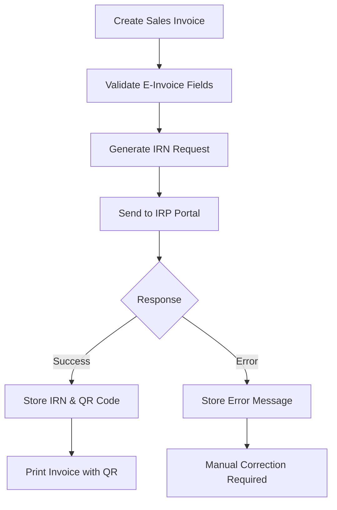
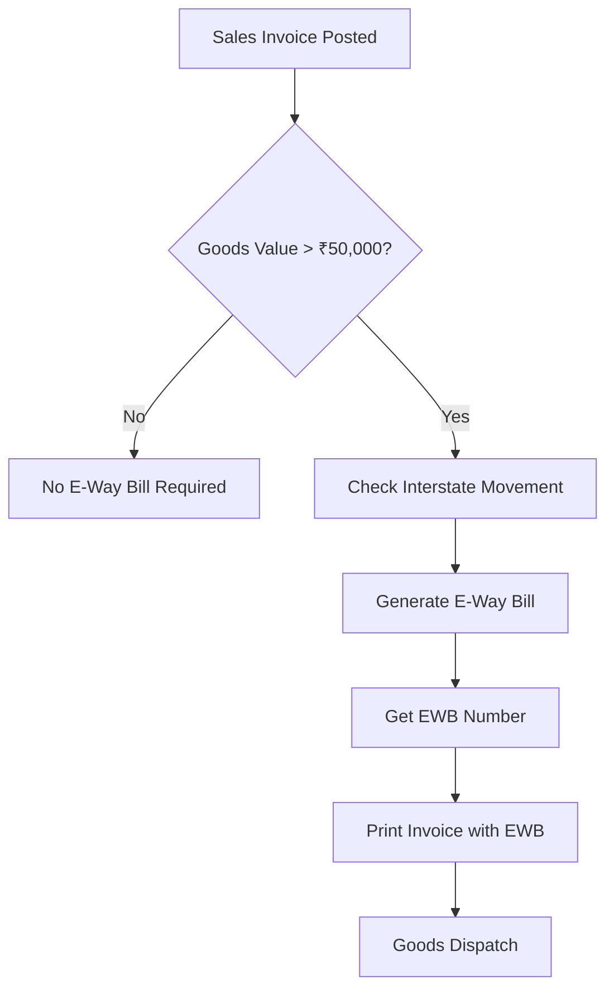
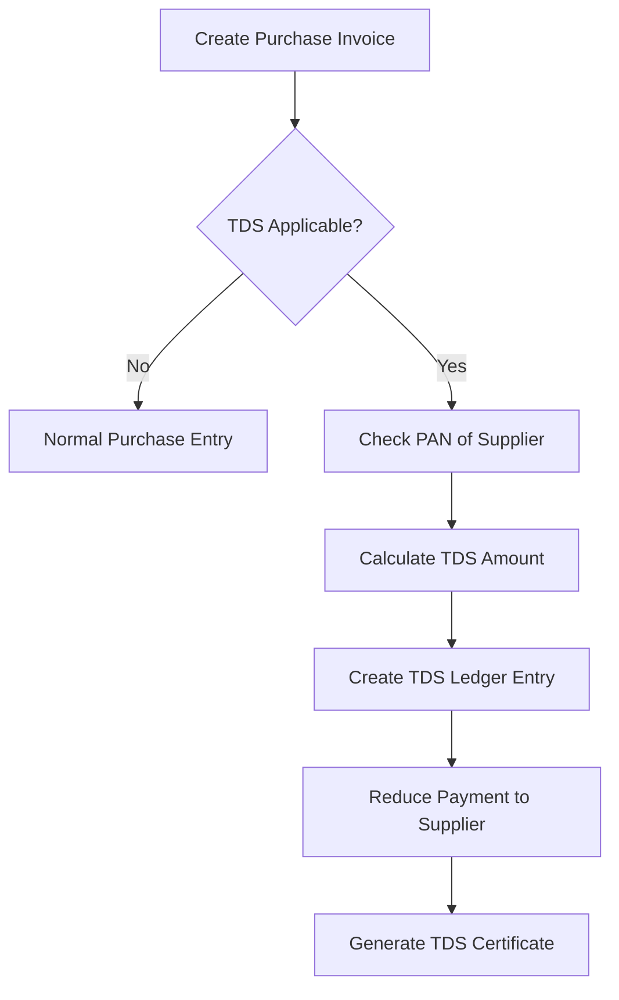

# Indian Invoice System & GST Compliance Documentation

## Table of Contents
1. [Overview](#overview)
2. [Current Implementation](#current-implementation)
3. [Indian Invoice Types](#indian-invoice-types)
4. [Sales Voucher Implementation](#sales-voucher-implementation)
5. [GST Compliance Features](#gst-compliance-features)
6. [E-Invoice Setup & Configuration](#e-invoice-setup--configuration)
7. [E-Way Bill Setup & Configuration](#e-way-bill-setup--configuration)
8. [TDS Setup & Configuration](#tds-setup--configuration)
9. [Sales Invoice Numbering Settings](#sales-invoice-numbering-settings)
10. [API Endpoints](#api-endpoints)
10. [Database Schema](#database-schema)
11. [Future Enhancements](#future-enhancements)

---

## Overview

The Finvera backend implements a comprehensive Indian GST-compliant invoicing system with support for various voucher types, automatic tax calculations, and integration with government portals for E-Invoice and E-Way Bill generation.

### Key Features
- ✅ Complete GST calculation (CGST, SGST, IGST)
- ✅ Multi-item invoicing with HSN/SAC codes
- ✅ Automatic ledger entries (double-entry bookkeeping)
- ✅ Sequential voucher numbering
- ✅ E-Invoice and E-Way Bill integration
- ✅ TDS calculation and compliance
- ✅ Multi-warehouse inventory management
- ✅ Bill-wise outstanding management

---

## Current Implementation

### Voucher Types Available

| Voucher Type | Category | Prefix | Description | Status |
|-------------|----------|--------|-------------|---------|
| Sales | sales | INV | Sales Invoice/Tax Invoice | ✅ Implemented |
| Purchase | purchase | PUR | Purchase Invoice | ✅ Implemented |
| Payment | payment | PAY | Payment Voucher | ✅ Implemented |
| Receipt | receipt | REC | Receipt Voucher | ✅ Implemented |
| Journal | journal | JV | Journal Entry | ✅ Implemented |
| Contra | contra | CNT | Contra Entry | ✅ Implemented |
| Debit Note | debit_note | DN | Debit Note | ✅ Implemented |
| Credit Note | credit_note | CN | Credit Note | ✅ Implemented |

### Sales Invoice Features

**✅ Currently Supported:**
- Tax Invoice (B2B GST Invoice)
- Complete GST calculations
- Multi-item support
- HSN/SAC code management
- Place of supply determination
- Reverse charge handling
- Round-off calculations
- Inventory integration
- COGS calculation

**❌ Not Yet Implemented:**
- Bill of Supply (for exempted goods)
- Retail Invoice (simplified B2C)
- Export Invoice (with LUT/Bond)
- Proforma Invoice
- Delivery Challan

---

## Indian Invoice Types

### 1. TAX INVOICE (Regular GST Invoice) ✅ IMPLEMENTED

**Used for:** B2B sales where buyer claims Input Tax Credit (ITC)

**Current Implementation:**
```javascript
// API Endpoint
POST /accounting/invoices/sales

// Sample Request
{
  "party_ledger_id": "uuid",
  "voucher_date": "2025-02-03",
  "place_of_supply": "Gujarat",
  "is_reverse_charge": false,
  "items": [
    {
      "item_description": "Laptop",
      "hsn_sac_code": "8471",
      "quantity": 2,
      "rate": 50000,
      "gst_rate": 18,
      "warehouse_id": "uuid"
    }
  ],
  "narration": "Sales to ABC Company"
}
```

**Generated Fields:**
- Sequential invoice number (INV202502001)
- Complete supplier and buyer details
- HSN codes and item descriptions
- GST breakdown (CGST/SGST or IGST)
- Total in figures and words
- Proper accounting entries

### 2. BILL OF SUPPLY ❌ NOT IMPLEMENTED

**Used for:** Sales of exempted goods/services or by composition dealers

**Required Implementation:**
- No GST charged
- Mentions "Bill of Supply" clearly
- Shows items as exempt/nil rated
- Different voucher type needed

### 3. RETAIL INVOICE (Simplified Invoice) ❌ NOT IMPLEMENTED

**Used for:** B2C sales where invoice value ≤ ₹50,000

**Required Implementation:**
- Can omit buyer's GSTIN
- Simplified buyer details
- Automatic detection based on amount threshold

### 4. EXPORT INVOICE ❌ NOT IMPLEMENTED

**Used for:** Export of goods/services

**Required Implementation:**
- Export destination country
- Port of loading/discharge
- Shipping Bill Number & Date
- Foreign currency support
- LUT/Bond reference

### 5. DEBIT NOTE ✅ IMPLEMENTED

**Used for:** Increasing invoice value after original invoice

**Current Implementation:**
```javascript
// Voucher type: 'Debit Note'
// References original invoice
// Automatic ledger adjustments
```

### 6. CREDIT NOTE ✅ IMPLEMENTED

**Used for:** Reducing invoice value after original invoice

**Current Implementation:**
```javascript
// Voucher type: 'Credit Note'
// References original invoice
// Automatic ledger adjustments
```

### 7. DELIVERY CHALLAN ❌ NOT IMPLEMENTED

**Used for:** Movement of goods WITHOUT sale

**Required Implementation:**
- Job work/processing documentation
- Stock transfer between branches
- No tax liability
- Movement tracking

### 8. RECEIPT VOUCHER ✅ IMPLEMENTED

**Used for:** Recording cash/bank receipts from customers

**Current Implementation:**
```javascript
POST /accounting/vouchers/receipt
// Automatic ledger entries
// Bill-wise allocation support
```

### 9. PROFORMA INVOICE ❌ NOT IMPLEMENTED

**Used for:** Quotation/offer before actual sale

**Required Implementation:**
- Marked as "PROFORMA INVOICE"
- No GST liability
- Conversion to actual invoice

---

## Sales Voucher Implementation

### Complete Sales Voucher Structure

```javascript
// HEADER SECTION
{
  "voucher_type": "Sales",
  "voucher_number": "INV202502001", // Auto-generated
  "voucher_date": "2025-02-03",
  "reference_number": "PO/2025/001"
}

// PARTY DETAILS
{
  "party_ledger_id": "customer-uuid",
  "place_of_supply": "Gujarat",
  "is_reverse_charge": false
}

// ITEM DETAILS (Line Items)
{
  "items": [
    {
      "inventory_item_id": "item-uuid",
      "warehouse_id": "warehouse-uuid",
      "item_code": "LAP001",
      "item_description": "Dell Laptop",
      "hsn_sac_code": "8471",
      "uqc": "PCS",
      "quantity": 2,
      "rate": 50000,
      "discount_percent": 5,
      "discount_amount": 5000,
      "taxable_amount": 95000,
      "gst_rate": 18,
      "cgst_amount": 8550,
      "sgst_amount": 8550,
      "igst_amount": 0,
      "cess_amount": 0,
      "total_amount": 112100
    }
  ]
}

// CALCULATION SECTION (Auto-calculated)
{
  "subtotal": 95000,
  "cgst_amount": 8550,
  "sgst_amount": 8550,
  "igst_amount": 0,
  "cess_amount": 0,
  "round_off": 0,
  "total_amount": 112100
}

// ACCOUNTING ENTRIES (Auto-generated)
{
  "ledger_entries": [
    {
      "ledger_id": "customer-ledger-id",
      "debit_amount": 112100,
      "credit_amount": 0,
      "narration": "Sales invoice to Customer Name"
    },
    {
      "ledger_id": "sales-ledger-id",
      "debit_amount": 0,
      "credit_amount": 95000,
      "narration": "Sales revenue"
    },
    {
      "ledger_id": "cgst-output-ledger-id",
      "debit_amount": 0,
      "credit_amount": 8550,
      "narration": "CGST Output"
    },
    {
      "ledger_id": "sgst-output-ledger-id",
      "debit_amount": 0,
      "credit_amount": 8550,
      "narration": "SGST Output"
    }
  ]
}
```

### GST Calculation Logic

```javascript
// Intrastate (Same State): CGST + SGST
if (supplierState === customerState) {
  cgst = (taxableAmount * gstRate) / 200;
  sgst = (taxableAmount * gstRate) / 200;
  igst = 0;
}

// Interstate (Different States): IGST
else {
  cgst = 0;
  sgst = 0;
  igst = (taxableAmount * gstRate) / 100;
}
```

---

## GST Compliance Features

### 1. GSTIN Management ✅ IMPLEMENTED

```javascript
// GSTIN Model
{
  "gstin": "24XXXXX1234X1Z5",
  "legal_name": "ABC Traders",
  "trade_name": "ABC Store",
  "state_code": "24",
  "is_default": true,
  "is_active": true
}

// API Endpoints
GET /gst/gstins
POST /gst/gstins
PUT /gst/gstins/:id
POST /gst/gstins/:id/set-default
```

### 2. HSN/SAC Code Support ✅ IMPLEMENTED

```javascript
// Integrated with inventory items
{
  "hsn_sac_code": "8471",
  "gst_rate": 18,
  "description": "Automatic data processing machines"
}
```

### 3. GST Returns ✅ IMPLEMENTED

```javascript
// GSTR-1 (Outward Supplies)
POST /gst/returns/gstr1
{
  "month": 2,
  "year": 2025,
  "gstin": "24XXXXX1234X1Z5"
}

// GSTR-3B (Summary Return)
POST /gst/returns/gstr3b
```

---

## E-Invoice Setup & Configuration

### Prerequisites
1. **GSTIN Registration** - Must be registered for GST
2. **E-Invoice Portal Access** - Registration on Invoice Registration Portal (IRP)
3. **API Credentials** - Username, Password, Client ID, Client Secret
4. **Digital Certificate** - For authentication (optional for sandbox)

### Configuration Steps

#### 1. Environment Variables
```bash
# E-Invoice API Configuration
EINVOICE_BASE_URL=https://api.einvoice.gov.in
EINVOICE_SANDBOX_URL=https://sandbox.einvoice.gov.in
EINVOICE_CLIENT_ID=your_client_id
EINVOICE_CLIENT_SECRET=your_client_secret
EINVOICE_USERNAME=your_username
EINVOICE_PASSWORD=your_password
EINVOICE_GSTIN=your_gstin
```

#### 2. Database Configuration
```sql
-- E-Invoice table already exists
CREATE TABLE e_invoices (
  id UUID PRIMARY KEY,
  voucher_id UUID REFERENCES vouchers(id),
  irn VARCHAR(64) UNIQUE, -- Invoice Reference Number
  ack_no VARCHAR(20), -- Acknowledgment Number
  ack_date TIMESTAMP,
  signed_invoice TEXT, -- Digitally signed invoice
  signed_qr_code TEXT, -- QR code data
  status ENUM('pending', 'generated', 'cancelled'),
  error_message TEXT,
  tenant_id VARCHAR NOT NULL
);
```

#### 3. API Integration
```javascript
// Generate E-Invoice
POST /gst/einvoice/generate
{
  "voucher_id": "uuid",
  "generate_qr": true
}

// Cancel E-Invoice
POST /gst/einvoice/:id/cancel
{
  "reason": "Data entry mistake",
  "remarks": "Wrong customer details"
}
```

### E-Invoice Mandatory Fields Validation

```javascript
// Supplier Details (Auto-filled from company)
- GSTIN, Legal Name, Address, State Code, PIN

// Buyer Details (From customer ledger)
- GSTIN (mandatory for B2B), Name, Address, State Code, PIN

// Invoice Details
- Invoice Number, Date, Type (INV/CRN/DBN)
- Place of Supply, Reverse Charge (Y/N)

// Item Details
- HSN/SAC Code (minimum 6 digits for turnover > 5 crores)
- Description, Quantity, Unit, Rate
- Taxable Value, GST Rate, GST Amount

// Document Total
- Total Invoice Value, Total Tax Amount
```

### E-Invoice Workflow



---

## E-Way Bill Setup & Configuration

### Prerequisites
1. **GSTIN Registration** - Must be registered for GST
2. **E-Way Bill Portal Access** - Registration on E-Way Bill portal
3. **API Credentials** - Username, Password, Client ID, Client Secret
4. **Transporter Details** - For goods movement

### Configuration Steps

#### 1. Environment Variables
```bash
# E-Way Bill API Configuration
EWAYBILL_BASE_URL=https://api.ewaybillgst.gov.in
EWAYBILL_SANDBOX_URL=https://sandbox.ewaybillgst.gov.in
EWAYBILL_CLIENT_ID=your_client_id
EWAYBILL_CLIENT_SECRET=your_client_secret
EWAYBILL_USERNAME=your_username
EWAYBILL_PASSWORD=your_password
EWAYBILL_GSTIN=your_gstin
```

#### 2. Database Configuration
```sql
-- E-Way Bill table already exists
CREATE TABLE e_way_bills (
  id UUID PRIMARY KEY,
  voucher_id UUID REFERENCES vouchers(id),
  ewb_no VARCHAR(20) UNIQUE, -- E-Way Bill Number
  ewb_date TIMESTAMP,
  valid_upto TIMESTAMP,
  status ENUM('active', 'cancelled', 'expired'),
  vehicle_no VARCHAR(20),
  transporter_id VARCHAR(15), -- Transporter GSTIN
  transporter_name VARCHAR(100),
  transport_mode ENUM('road', 'rail', 'air', 'ship'),
  distance INTEGER, -- in KM
  tenant_id VARCHAR NOT NULL
);
```

#### 3. API Integration
```javascript
// Generate E-Way Bill
POST /gst/ewaybill/generate
{
  "voucher_id": "uuid",
  "transporter_id": "24TRANS1234T1Z5",
  "transporter_name": "ABC Transport",
  "transport_mode": "road",
  "vehicle_no": "GJ01AB1234",
  "distance": 150
}

// Cancel E-Way Bill
POST /gst/ewaybill/:id/cancel
{
  "reason": "Duplicate",
  "remarks": "Generated by mistake"
}
```

### E-Way Bill Mandatory Conditions

```javascript
// When E-Way Bill is Required:
1. Goods value > ₹50,000
2. Interstate movement of goods
3. Intrastate movement (if state mandates)
4. Transportation by registered person

// Exemptions:
1. Services (no goods movement)
2. Goods by non-motorized transport
3. Goods transported for less than 10 KM within state
4. Specific exempted goods (newspapers, etc.)
```

### E-Way Bill Workflow



---

## TDS Setup & Configuration

### Prerequisites
1. **TAN Registration** - Tax Deduction Account Number
2. **TDS Sections Knowledge** - Different TDS rates for different payments
3. **PAN of Deductees** - Required for TDS deduction
4. **TDS Return Filing** - Quarterly return filing setup

### Configuration Steps

#### 1. Environment Variables
```bash
# TDS API Configuration (Sandbox)
TDS_BASE_URL=https://api.tdssandbox.gov.in
TDS_CLIENT_ID=your_client_id
TDS_CLIENT_SECRET=your_client_secret
TDS_TAN=your_tan_number
```

#### 2. Database Configuration
```sql
-- TDS tables already exist
CREATE TABLE tds_details (
  id UUID PRIMARY KEY,
  voucher_id UUID REFERENCES vouchers(id),
  section_code VARCHAR(10), -- 194C, 194I, etc.
  tds_rate DECIMAL(5,2),
  taxable_amount DECIMAL(15,2),
  tds_amount DECIMAL(15,2),
  deductee_pan VARCHAR(10),
  deductee_name VARCHAR(100),
  tenant_id VARCHAR NOT NULL
);
```

#### 3. TDS Sections Configuration

```javascript
// Common TDS Sections
const TDS_SECTIONS = {
  "194C": {
    "description": "Payment to contractors",
    "rate": 1.0, // 1% for individuals, 2% for companies
    "threshold": 30000,
    "applicable_to": "contractors"
  },
  "194I": {
    "description": "Rent payment",
    "rate": 10.0,
    "threshold": 180000,
    "applicable_to": "rent"
  },
  "194J": {
    "description": "Professional fees",
    "rate": 10.0,
    "threshold": 30000,
    "applicable_to": "professionals"
  },
  "194H": {
    "description": "Commission/Brokerage",
    "rate": 5.0,
    "threshold": 15000,
    "applicable_to": "agents"
  }
};
```

#### 4. TDS Calculation Logic

```javascript
// TDS Calculation in Purchase Invoice
async function calculateTDS(purchaseData) {
  const { party_ledger_id, items, tds_section } = purchaseData;
  
  // Get party PAN and TDS applicability
  const party = await Ledger.findByPk(party_ledger_id);
  
  if (!party.pan || !tds_section) {
    return { tds_amount: 0 };
  }
  
  // Calculate taxable amount (excluding GST)
  const taxableAmount = items.reduce((sum, item) => sum + item.taxable_amount, 0);
  
  // Get TDS rate for section
  const tdsRate = TDS_SECTIONS[tds_section].rate;
  const threshold = TDS_SECTIONS[tds_section].threshold;
  
  // Apply threshold check
  if (taxableAmount < threshold) {
    return { tds_amount: 0 };
  }
  
  // Calculate TDS
  const tdsAmount = (taxableAmount * tdsRate) / 100;
  
  return {
    tds_amount: tdsAmount,
    taxable_amount: taxableAmount,
    tds_rate: tdsRate,
    section_code: tds_section
  };
}
```

#### 5. TDS API Integration

```javascript
// TDS Calculation API
POST /tds/calculate
{
  "section_code": "194C",
  "taxable_amount": 100000,
  "deductee_pan": "ABCDE1234F",
  "payment_date": "2025-02-03"
}

// TDS Certificate Generation
POST /tds/:id/generate-certificate
{
  "quarter": "Q4",
  "financial_year": "2024-25"
}

// TDS Return Generation
POST /tds/generate-return
{
  "quarter": "Q4",
  "financial_year": "2024-25",
  "tan": "ABCD12345E"
}
```

### TDS Workflow in Purchase Invoice



### TDS Ledger Entries

```javascript
// Purchase with TDS
// Suppose: Purchase ₹1,00,000, TDS @1% = ₹1,000

const ledgerEntries = [
  {
    ledger_id: "purchase_ledger_id",
    debit_amount: 100000,
    credit_amount: 0,
    narration: "Purchase from supplier"
  },
  {
    ledger_id: "supplier_ledger_id",
    debit_amount: 0,
    credit_amount: 99000, // Reduced by TDS
    narration: "Amount payable to supplier (after TDS)"
  },
  {
    ledger_id: "tds_payable_ledger_id",
    debit_amount: 0,
    credit_amount: 1000,
    narration: "TDS deducted u/s 194C"
  }
];
```

---

## Sales Invoice Numbering Settings

### Overview

The system provides flexible invoice numbering with automatic sequence generation, customizable prefixes, and compliance with Indian GST regulations. Invoice numbers must be sequential, unique, and follow specific patterns for different voucher types.

### Current Implementation ✅

#### Automatic Numbering Logic
```javascript
// Current numbering format: {PREFIX}{YEAR}{MONTH}{SEQUENCE}
// Example: INV202502001, INV202502002, etc.

const generateVoucherNumber = async (voucherType, tenantId) => {
  const date = new Date();
  const year = date.getFullYear();
  const month = String(date.getMonth() + 1).padStart(2, '0');
  
  // Get the next sequence number for this voucher type
  const lastVoucher = await Voucher.findOne({
    where: {
      voucher_type: voucherType,
      tenant_id: tenantId,
    },
    order: [['voucher_number', 'DESC']],
  });
  
  let sequence = 1;
  if (lastVoucher) {
    const lastNumber = lastVoucher.voucher_number;
    const lastSequence = parseInt(lastNumber.slice(-4));
    sequence = lastSequence + 1;
  }
  
  const prefix = getVoucherPrefix(voucherType); // 'INV' for Sales
  return `${prefix}${year}${month}${String(sequence).padStart(4, '0')}`;
};
```

#### Default Prefixes by Voucher Type
```javascript
const VOUCHER_PREFIXES = {
  'Sales': 'INV',           // INV202502001
  'Purchase': 'PUR',        // PUR202502001
  'Payment': 'PAY',         // PAY202502001
  'Receipt': 'REC',         // REC202502001
  'Journal': 'JV',          // JV202502001
  'Contra': 'CNT',          // CNT202502001
  'Debit Note': 'DN',       // DN202502001
  'Credit Note': 'CN'       // CN202502001
};
```

### Advanced Numbering Settings (Recommended Implementation)

#### 1. Tenant-Level Numbering Configuration

```javascript
// Add to tenant settings or create separate table
const invoiceNumberingSettings = {
  tenant_id: "tenant-uuid",
  settings: {
    sales_invoice: {
      prefix: "INV",
      format: "{PREFIX}{YEAR}{MONTH}{SEQUENCE}",
      sequence_length: 4,
      reset_frequency: "yearly", // monthly, yearly, never
      start_number: 1,
      current_sequence: 156,
      separator: "", // Optional separator like INV-2025-02-001
      include_branch_code: false,
      branch_code_position: "after_prefix" // before_prefix, after_prefix
    },
    purchase_invoice: {
      prefix: "PUR",
      format: "{PREFIX}{YEAR}{MONTH}{SEQUENCE}",
      sequence_length: 4,
      reset_frequency: "yearly",
      start_number: 1,
      current_sequence: 89
    }
    // ... other voucher types
  }
};
```

#### 2. Multiple Numbering Series Support

```javascript
// Support for multiple series per voucher type
const numberingSeries = [
  {
    id: "series-1",
    tenant_id: "tenant-uuid",
    voucher_type: "Sales",
    series_name: "Regular Sales",
    prefix: "INV",
    format: "{PREFIX}{YEAR}{MONTH}{SEQUENCE}",
    is_default: true,
    is_active: true,
    current_sequence: 156,
    start_number: 1,
    end_number: 9999,
    reset_frequency: "yearly"
  },
  {
    id: "series-2", 
    tenant_id: "tenant-uuid",
    voucher_type: "Sales",
    series_name: "Export Sales",
    prefix: "EXP",
    format: "{PREFIX}{YEAR}{SEQUENCE}",
    is_default: false,
    is_active: true,
    current_sequence: 45,
    start_number: 1,
    end_number: 999,
    reset_frequency: "yearly"
  }
];
```

#### 3. Branch-wise Numbering

```javascript
// Branch-specific numbering
const branchNumbering = {
  tenant_id: "tenant-uuid",
  branch_id: "branch-uuid",
  settings: {
    sales_invoice: {
      prefix: "MUM", // Branch code
      format: "{BRANCH}{PREFIX}{YEAR}{SEQUENCE}",
      sequence_length: 4,
      current_sequence: 234
    }
  }
};

// Generated numbers: MUMINV2025001, MUMINV2025002, etc.
```

### Numbering Format Options

#### Available Format Tokens
```javascript
const FORMAT_TOKENS = {
  '{PREFIX}': 'Voucher type prefix (INV, PUR, etc.)',
  '{YEAR}': 'Full year (2025)',
  '{YY}': 'Short year (25)',
  '{MONTH}': 'Month with zero padding (02)',
  '{MM}': 'Month without padding (2)',
  '{SEQUENCE}': 'Sequential number with padding',
  '{BRANCH}': 'Branch code',
  '{COMPANY}': 'Company code',
  '{SEPARATOR}': 'Custom separator (-, /, etc.)'
};
```

#### Format Examples
```javascript
const formatExamples = [
  {
    format: "{PREFIX}{YEAR}{MONTH}{SEQUENCE}",
    example: "INV202502001",
    description: "Default format"
  },
  {
    format: "{PREFIX}{SEPARATOR}{YEAR}{SEPARATOR}{SEQUENCE}",
    separator: "-",
    example: "INV-2025-001",
    description: "With separators"
  },
  {
    format: "{BRANCH}{PREFIX}{YY}{SEQUENCE}",
    example: "MUMBAIINV25001",
    description: "Branch + short year"
  },
  {
    format: "{PREFIX}{YY}{MM}{SEQUENCE}",
    example: "INV250201",
    description: "Short year + month"
  },
  {
    format: "{COMPANY}{PREFIX}{SEQUENCE}",
    example: "ABCINV001",
    description: "Company code prefix"
  }
];
```

### Database Schema for Numbering Settings

#### Numbering Series Table
```sql
CREATE TABLE numbering_series (
  id UUID PRIMARY KEY,
  tenant_id VARCHAR NOT NULL,
  branch_id UUID, -- Optional for branch-specific numbering
  voucher_type VARCHAR NOT NULL,
  series_name VARCHAR(100) NOT NULL,
  prefix VARCHAR(10) NOT NULL,
  format VARCHAR(100) NOT NULL DEFAULT '{PREFIX}{YEAR}{MONTH}{SEQUENCE}',
  separator VARCHAR(5) DEFAULT '',
  sequence_length INTEGER DEFAULT 4,
  current_sequence INTEGER DEFAULT 0,
  start_number INTEGER DEFAULT 1,
  end_number INTEGER DEFAULT 9999,
  reset_frequency ENUM('never', 'monthly', 'yearly', 'financial_year') DEFAULT 'yearly',
  last_reset_date DATE,
  is_default BOOLEAN DEFAULT false,
  is_active BOOLEAN DEFAULT true,
  created_at TIMESTAMP DEFAULT CURRENT_TIMESTAMP,
  updated_at TIMESTAMP DEFAULT CURRENT_TIMESTAMP ON UPDATE CURRENT_TIMESTAMP,
  
  UNIQUE KEY unique_default_series (tenant_id, voucher_type, is_default),
  INDEX idx_tenant_voucher (tenant_id, voucher_type),
  INDEX idx_active_series (tenant_id, voucher_type, is_active)
);
```

#### Numbering History Table
```sql
CREATE TABLE numbering_history (
  id UUID PRIMARY KEY,
  series_id UUID REFERENCES numbering_series(id),
  voucher_id UUID REFERENCES vouchers(id),
  generated_number VARCHAR(50) NOT NULL,
  sequence_used INTEGER NOT NULL,
  generated_at TIMESTAMP DEFAULT CURRENT_TIMESTAMP,
  tenant_id VARCHAR NOT NULL,
  
  INDEX idx_series_sequence (series_id, sequence_used),
  INDEX idx_voucher_number (voucher_id),
  INDEX idx_tenant_date (tenant_id, generated_at)
);
```

### API Endpoints for Numbering Settings

#### Numbering Series Management
```javascript
// Get all numbering series
GET /accounting/numbering-series
Response: {
  "series": [
    {
      "id": "uuid",
      "voucher_type": "Sales",
      "series_name": "Regular Sales",
      "prefix": "INV",
      "format": "{PREFIX}{YEAR}{MONTH}{SEQUENCE}",
      "current_sequence": 156,
      "is_default": true,
      "next_number": "INV202502157"
    }
  ]
}

// Create new numbering series
POST /accounting/numbering-series
{
  "voucher_type": "Sales",
  "series_name": "Export Sales",
  "prefix": "EXP",
  "format": "{PREFIX}{YEAR}{SEQUENCE}",
  "sequence_length": 3,
  "start_number": 1,
  "reset_frequency": "yearly"
}

// Update numbering series
PUT /accounting/numbering-series/:id
{
  "prefix": "EXPORT",
  "format": "{PREFIX}{SEPARATOR}{YEAR}{SEPARATOR}{SEQUENCE}",
  "separator": "-"
}

// Set default series
POST /accounting/numbering-series/:id/set-default

// Preview next number
GET /accounting/numbering-series/:id/preview
Response: {
  "next_number": "INV202502157",
  "current_sequence": 156
}
```

#### Voucher Number Generation
```javascript
// Generate next number for voucher type
POST /accounting/vouchers/generate-number
{
  "voucher_type": "Sales",
  "series_id": "uuid" // Optional, uses default if not provided
}
Response: {
  "voucher_number": "INV202502157",
  "series_id": "uuid",
  "sequence": 157
}

// Reserve number (for draft vouchers)
POST /accounting/vouchers/reserve-number
{
  "voucher_type": "Sales",
  "series_id": "uuid"
}

// Release reserved number (if voucher cancelled)
POST /accounting/vouchers/release-number
{
  "voucher_number": "INV202502157"
}
```

### Numbering Service Implementation

#### Core Numbering Service
```javascript
class NumberingService {
  
  async generateVoucherNumber(tenantId, voucherType, seriesId = null, branchId = null) {
    const transaction = await sequelize.transaction();
    
    try {
      // Get numbering series (default if seriesId not provided)
      const series = await this.getNumberingSeries(tenantId, voucherType, seriesId, branchId);
      
      // Check if reset is needed
      await this.checkAndResetSequence(series);
      
      // Generate next sequence number
      const nextSequence = await this.getNextSequence(series.id, transaction);
      
      // Format the voucher number
      const voucherNumber = this.formatVoucherNumber(series, nextSequence);
      
      // Update current sequence
      await this.updateCurrentSequence(series.id, nextSequence, transaction);
      
      await transaction.commit();
      
      return {
        voucher_number: voucherNumber,
        series_id: series.id,
        sequence: nextSequence
      };
      
    } catch (error) {
      await transaction.rollback();
      throw error;
    }
  }
  
  formatVoucherNumber(series, sequence) {
    const date = new Date();
    const tokens = {
      '{PREFIX}': series.prefix,
      '{YEAR}': date.getFullYear().toString(),
      '{YY}': date.getFullYear().toString().slice(-2),
      '{MONTH}': String(date.getMonth() + 1).padStart(2, '0'),
      '{MM}': String(date.getMonth() + 1),
      '{SEQUENCE}': String(sequence).padStart(series.sequence_length, '0'),
      '{SEPARATOR}': series.separator || '',
      '{BRANCH}': series.branch_code || '',
      '{COMPANY}': series.company_code || ''
    };
    
    let formatted = series.format;
    Object.entries(tokens).forEach(([token, value]) => {
      formatted = formatted.replace(new RegExp(token, 'g'), value);
    });
    
    return formatted;
  }
  
  async checkAndResetSequence(series) {
    const now = new Date();
    const lastReset = series.last_reset_date ? new Date(series.last_reset_date) : null;
    
    let shouldReset = false;
    
    switch (series.reset_frequency) {
      case 'monthly':
        shouldReset = !lastReset || 
          lastReset.getMonth() !== now.getMonth() || 
          lastReset.getFullYear() !== now.getFullYear();
        break;
        
      case 'yearly':
        shouldReset = !lastReset || lastReset.getFullYear() !== now.getFullYear();
        break;
        
      case 'financial_year':
        const currentFY = this.getFinancialYear(now);
        const lastResetFY = lastReset ? this.getFinancialYear(lastReset) : null;
        shouldReset = !lastResetFY || currentFY !== lastResetFY;
        break;
        
      case 'never':
      default:
        shouldReset = false;
    }
    
    if (shouldReset) {
      await this.resetSequence(series.id);
    }
  }
  
  getFinancialYear(date) {
    const year = date.getFullYear();
    const month = date.getMonth() + 1; // 1-12
    return month >= 4 ? year : year - 1; // FY starts from April
  }
}
```

### Configuration UI Settings

#### Frontend Settings Interface
```javascript
// Settings form structure for numbering configuration
const numberingSettingsForm = {
  voucher_type: "Sales",
  series_name: "Regular Sales Invoices",
  prefix: "INV",
  format: "{PREFIX}{YEAR}{MONTH}{SEQUENCE}",
  separator: "",
  sequence_length: 4,
  start_number: 1,
  reset_frequency: "yearly",
  include_branch_code: false,
  branch_code_position: "after_prefix",
  preview: "INV202502001" // Live preview
};
```

#### Validation Rules
```javascript
const validationRules = {
  prefix: {
    required: true,
    maxLength: 10,
    pattern: /^[A-Z0-9]+$/, // Only uppercase letters and numbers
    message: "Prefix must contain only uppercase letters and numbers"
  },
  format: {
    required: true,
    mustContain: ['{PREFIX}', '{SEQUENCE}'],
    message: "Format must contain {PREFIX} and {SEQUENCE} tokens"
  },
  sequence_length: {
    min: 1,
    max: 10,
    message: "Sequence length must be between 1 and 10"
  },
  start_number: {
    min: 1,
    message: "Start number must be at least 1"
  }
};
```

### GST Compliance for Invoice Numbering

#### Legal Requirements
```javascript
// GST Act requirements for invoice numbering:
const gstRequirements = {
  sequential: true, // Must be sequential
  unique: true, // Must be unique within financial year
  maxLength: 16, // Maximum 16 characters
  noSpecialChars: false, // Can contain alphanumeric and some special chars
  mandatoryReset: "financial_year", // Must reset every financial year
  allowedFormats: [
    "Alphanumeric",
    "Numeric only", 
    "With hyphens/slashes"
  ]
};
```

#### Compliance Validation
```javascript
const validateGSTCompliance = (voucherNumber, voucherType) => {
  const validations = [
    {
      rule: voucherNumber.length <= 16,
      message: "Invoice number cannot exceed 16 characters"
    },
    {
      rule: /^[A-Za-z0-9\-\/]+$/.test(voucherNumber),
      message: "Invoice number can only contain letters, numbers, hyphens, and slashes"
    },
    {
      rule: !voucherNumber.includes('  '), // No double spaces
      message: "Invoice number cannot contain consecutive spaces"
    }
  ];
  
  return validations.filter(v => !v.rule).map(v => v.message);
};
```

### Migration Script for Existing Data

#### Update Existing Vouchers
```sql
-- Create default numbering series for existing tenants
INSERT INTO numbering_series (
  id, tenant_id, voucher_type, series_name, prefix, 
  format, current_sequence, is_default, is_active
)
SELECT 
  UUID() as id,
  tenant_id,
  voucher_type,
  CONCAT(voucher_type, ' Series') as series_name,
  CASE voucher_type
    WHEN 'Sales' THEN 'INV'
    WHEN 'Purchase' THEN 'PUR'
    WHEN 'Payment' THEN 'PAY'
    WHEN 'Receipt' THEN 'REC'
    WHEN 'Journal' THEN 'JV'
    WHEN 'Contra' THEN 'CNT'
    WHEN 'Debit Note' THEN 'DN'
    WHEN 'Credit Note' THEN 'CN'
  END as prefix,
  '{PREFIX}{YEAR}{MONTH}{SEQUENCE}' as format,
  COALESCE(MAX(CAST(RIGHT(voucher_number, 4) AS UNSIGNED)), 0) as current_sequence,
  true as is_default,
  true as is_active
FROM vouchers
GROUP BY tenant_id, voucher_type;
```

### Best Practices

#### Numbering Strategy Recommendations
1. **Keep it Simple**: Use standard format like INV202502001
2. **Plan for Scale**: Use adequate sequence length (4-6 digits)
3. **Branch Coding**: Use 2-3 character branch codes if needed
4. **Reset Policy**: Yearly reset is most common and GST compliant
5. **Backup Strategy**: Maintain numbering history for audit trails

#### Common Pitfalls to Avoid
1. **Gaps in Sequence**: Ensure no gaps in numbering for compliance
2. **Duplicate Numbers**: Implement proper locking mechanisms
3. **Format Changes**: Avoid changing format mid-year
4. **Manual Override**: Limit manual number entry to avoid conflicts
5. **Timezone Issues**: Use consistent timezone for date-based formatting

---

## API Endpoints

### Sales Invoice APIs
```javascript
// Create Sales Invoice
POST /accounting/invoices/sales

// Get Sales Invoices
GET /accounting/vouchers?voucher_type=Sales

// Update Sales Invoice
PUT /accounting/vouchers/:id

// Delete Sales Invoice
DELETE /accounting/vouchers/:id

// Post Sales Invoice
POST /accounting/vouchers/:id/post
```

### E-Invoice APIs
```javascript
// Generate E-Invoice
POST /gst/einvoice/generate

// Cancel E-Invoice
POST /gst/einvoice/:id/cancel

// Get E-Invoice List
GET /gst/einvoice

// Get E-Invoice Details
GET /gst/einvoice/:id
```

### E-Way Bill APIs
```javascript
// Generate E-Way Bill
POST /gst/ewaybill/generate

// Cancel E-Way Bill
POST /gst/ewaybill/:id/cancel

// Get E-Way Bill List
GET /gst/ewaybill

// Update Vehicle Details
PUT /gst/ewaybill/:id/vehicle
```

### TDS APIs
```javascript
// Calculate TDS
POST /tds/calculate

// Generate TDS Certificate
POST /tds/:id/generate-certificate

// Generate TDS Return
POST /tds/generate-return

// Get TDS Details
GET /tds?quarter=Q4&year=2024-25
```

---

## Database Schema

### Core Tables

#### Vouchers Table
```sql
CREATE TABLE vouchers (
  id UUID PRIMARY KEY,
  voucher_number VARCHAR NOT NULL,
  voucher_type VARCHAR NOT NULL,
  voucher_date DATE NOT NULL,
  party_ledger_id UUID,
  total_amount DECIMAL(15,2) NOT NULL,
  narration TEXT,
  status ENUM('draft', 'posted', 'cancelled') DEFAULT 'draft',
  reference_number VARCHAR,
  due_date DATE,
  tenant_id VARCHAR NOT NULL,
  created_by UUID,
  created_at TIMESTAMP,
  updated_at TIMESTAMP
);
```

#### Voucher Items Table
```sql
CREATE TABLE voucher_items (
  id UUID PRIMARY KEY,
  voucher_id UUID REFERENCES vouchers(id),
  inventory_item_id UUID,
  warehouse_id UUID,
  item_code VARCHAR,
  item_description VARCHAR NOT NULL,
  hsn_sac_code VARCHAR,
  uqc VARCHAR,
  quantity DECIMAL(15,3) DEFAULT 1,
  rate DECIMAL(15,2) DEFAULT 0,
  discount_percent DECIMAL(6,2) DEFAULT 0,
  discount_amount DECIMAL(15,2) DEFAULT 0,
  taxable_amount DECIMAL(15,2) DEFAULT 0,
  gst_rate DECIMAL(6,2) DEFAULT 0,
  cgst_amount DECIMAL(15,2) DEFAULT 0,
  sgst_amount DECIMAL(15,2) DEFAULT 0,
  igst_amount DECIMAL(15,2) DEFAULT 0,
  cess_amount DECIMAL(15,2) DEFAULT 0,
  total_amount DECIMAL(15,2) DEFAULT 0,
  tenant_id VARCHAR NOT NULL
);
```

#### E-Invoice Table
```sql
CREATE TABLE e_invoices (
  id UUID PRIMARY KEY,
  voucher_id UUID REFERENCES vouchers(id),
  irn VARCHAR(64) UNIQUE,
  ack_no VARCHAR(20),
  ack_date TIMESTAMP,
  signed_invoice TEXT,
  signed_qr_code TEXT,
  status ENUM('pending', 'generated', 'cancelled') DEFAULT 'pending',
  error_message TEXT,
  tenant_id VARCHAR NOT NULL
);
```

#### E-Way Bill Table
```sql
CREATE TABLE e_way_bills (
  id UUID PRIMARY KEY,
  voucher_id UUID REFERENCES vouchers(id),
  ewb_no VARCHAR(20) UNIQUE,
  ewb_date TIMESTAMP,
  valid_upto TIMESTAMP,
  status ENUM('active', 'cancelled', 'expired') DEFAULT 'active',
  vehicle_no VARCHAR(20),
  transporter_id VARCHAR(15),
  transporter_name VARCHAR(100),
  transport_mode ENUM('road', 'rail', 'air', 'ship') DEFAULT 'road',
  distance INTEGER,
  tenant_id VARCHAR NOT NULL
);
```

#### TDS Details Table
```sql
CREATE TABLE tds_details (
  id UUID PRIMARY KEY,
  voucher_id UUID REFERENCES vouchers(id),
  section_code VARCHAR(10) NOT NULL,
  tds_rate DECIMAL(5,2) NOT NULL,
  taxable_amount DECIMAL(15,2) NOT NULL,
  tds_amount DECIMAL(15,2) NOT NULL,
  deductee_pan VARCHAR(10),
  deductee_name VARCHAR(100),
  certificate_no VARCHAR(20),
  tenant_id VARCHAR NOT NULL
);
```

---

## Future Enhancements

### Phase 1: Additional Invoice Types
1. **Bill of Supply Implementation**
   - New voucher type for exempted goods
   - Composition dealer support
   - Zero-rated supplies handling

2. **Retail Invoice (B2C)**
   - Automatic detection based on amount threshold
   - Simplified customer details
   - Optional GSTIN field

3. **Export Invoice**
   - Foreign currency support
   - LUT/Bond integration
   - Shipping bill reference
   - Port and country details

### Phase 2: Advanced Features
1. **Proforma Invoice**
   - Quotation management
   - Conversion to actual invoice
   - Validity period tracking

2. **Delivery Challan**
   - Job work documentation
   - Stock transfer tracking
   - Return challan support

3. **Multi-currency Support**
   - Foreign exchange rates
   - Currency conversion
   - Export invoice compliance

### Phase 3: Integration Enhancements
1. **Advanced E-Invoice Features**
   - Bulk generation
   - Auto-retry mechanism
   - Error handling improvements

2. **E-Way Bill Enhancements**
   - Vehicle tracking
   - Multi-vehicle support
   - Consolidation features

3. **TDS Improvements**
   - Auto-section detection
   - Bulk certificate generation
   - Return filing automation

### Phase 4: Compliance & Reporting
1. **GST Return Automation**
   - Auto-populate returns
   - Reconciliation features
   - Error detection

2. **Audit Trail**
   - Complete transaction history
   - User activity logging
   - Compliance reporting

3. **Dashboard & Analytics**
   - GST liability tracking
   - TDS summary reports
   - Compliance status monitoring

---

## Configuration Checklist

### Initial Setup
- [ ] Configure GSTIN details
- [ ] Set up company information
- [ ] Configure tax rates and HSN codes
- [ ] Set up customer and supplier ledgers
- [ ] Configure inventory items with HSN codes

### E-Invoice Setup
- [ ] Obtain E-Invoice portal credentials
- [ ] Configure API endpoints and authentication
- [ ] Test with sandbox environment
- [ ] Set up error handling and retry logic
- [ ] Configure QR code generation

### E-Way Bill Setup
- [ ] Obtain E-Way Bill portal credentials
- [ ] Configure transporter details
- [ ] Set up vehicle master data
- [ ] Configure distance calculation
- [ ] Test generation and cancellation

### TDS Setup
- [ ] Configure TAN details
- [ ] Set up TDS sections and rates
- [ ] Configure deductee PAN validation
- [ ] Set up TDS ledgers
- [ ] Configure certificate generation

### Testing
- [ ] Test all invoice types
- [ ] Verify GST calculations
- [ ] Test E-Invoice generation
- [ ] Test E-Way Bill generation
- [ ] Verify TDS calculations
- [ ] Test return generation

---

## Support & Maintenance

### Monitoring
- API response times and success rates
- Error logs and failure patterns
- Compliance status tracking
- User activity monitoring

### Regular Updates
- GST rate changes
- TDS section updates
- API endpoint changes
- Compliance requirement updates

### Backup & Recovery
- Daily database backups
- Transaction log backups
- Configuration backups
- Disaster recovery procedures

---

*Last Updated: February 3, 2025*
*Version: 1.0*
*Author: Finvera Development Team*